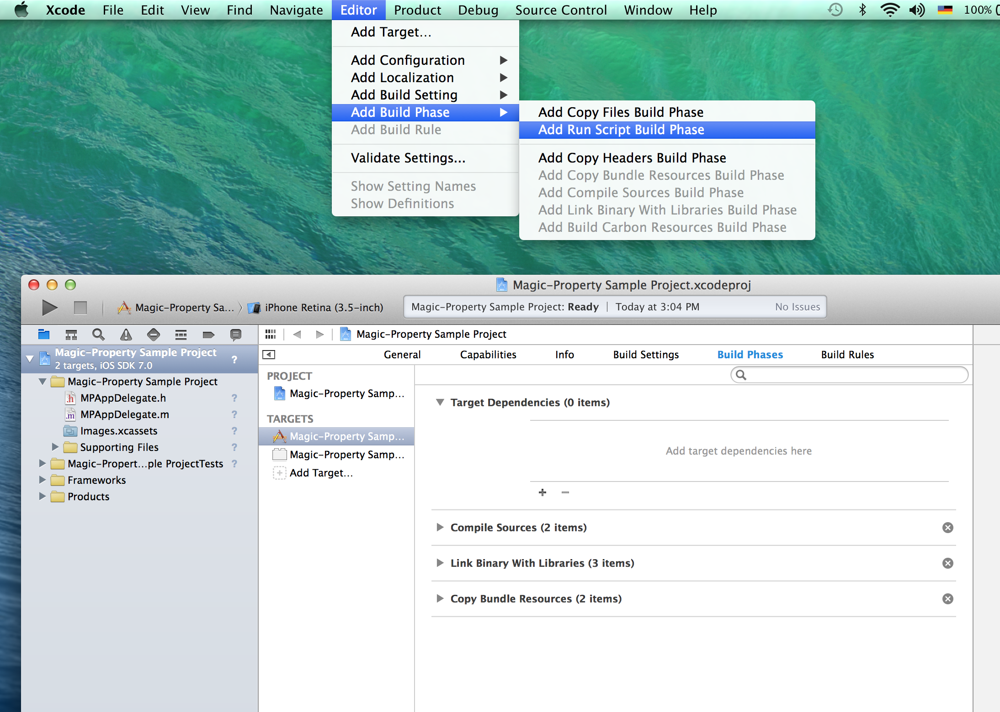
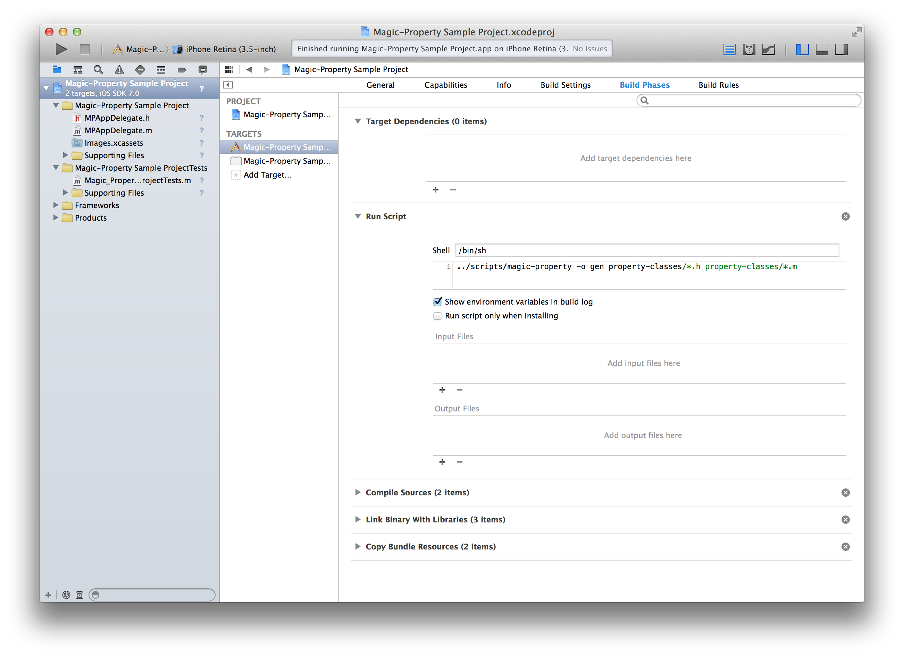
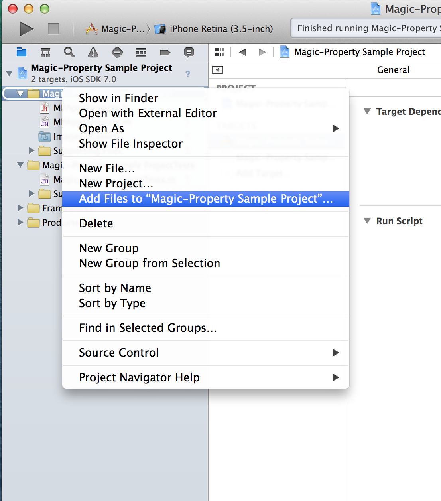

magic-property
==============

*Objective-C data records made easy.*

magic-property generates immutable Objective-C classes with init, copy, isEqual and hash
methods from a simple header file with just a list of properties.

Features
--------
 * Automatically generated immutable Objective-C classes
 * correct isEqual and hash implementation
 * init, new and copy methods for/with all properties
 * description method with human-readable output
 * all property attributes (e.g. nonatomic, strong) supported
 * ARC support
 * NSCoding and NSCopying supported
 * support for extra method implementations and custom property setters and
   accessors
 * support for custom typedefs and enums
 * no special compiler features needed

Usage
-----

### Sample Header ####

A simple header like this is enough to generate the immutable Objective-C class:
```objective-c
#import <Foundation/Foundation.h>

#import "Address.h"

@interface PhonebookEntry : NSObject
@property (nonatomic, strong, readonly) NSString *name;
@property (nonatomic, strong, readonly) NSString *email;
@property (nonatomic, strong, readonly) NSArray *phoneNumbers;
@property (nonatomic, strong, readonly) NSString *birthday;
@property (nonatomic, strong, readonly) Address *address;
@end
```

Just add the header file to the input file of the magic-property script and the
actual class header and implementation file will be generated by the script.

### Custom methods ###

magic-property can use custom and extra methods to override the default
behavior. Simply add the methods to override or to add in a m-file. There is no
need to manually add any of the generated methods.

```objective-c
@implementation PhonebookEntry
+ (PhonebookEntry *)parseFromString:(NSString *)
{
   ... // the parse code is added to the final class by the script
}

- (NSString *)serializeToString
{
    ... // this becomes a method of the immutable class
}
@end
```

XCode Integration
------------

magic-property can be used as standalone script but XCode integration can be setup with these simple steps:

### Step 1: Copy magic-property script ###

Copy the scripts folder to your project.

### Step 2: Create folder and property files ###

Create a folder where the generated code will be placed (e.g. gen) and a folder
where all your property header files will go (e.g. property-classes). Add the
property header files (*.h) you want to use with magic-property

### Step 3: Add the script as a build phase ###

Add a "Run script" build phase to XCode.


Make sure the script build phase is before compiling sources and add the
following code:
```
scripts/magic-property -o gen property-classes/*.h property-classes/*.m
```
Make sure to change the paths to the correct location you chose for the
magic-property script, generated code folder and input folder.



### Step 4: Add generated files ###

Build your project once. The build will generate the necessary files in the
output folder. Add these files to your XCode project. Note that this step has to
be repeated every time you add a new property class.


